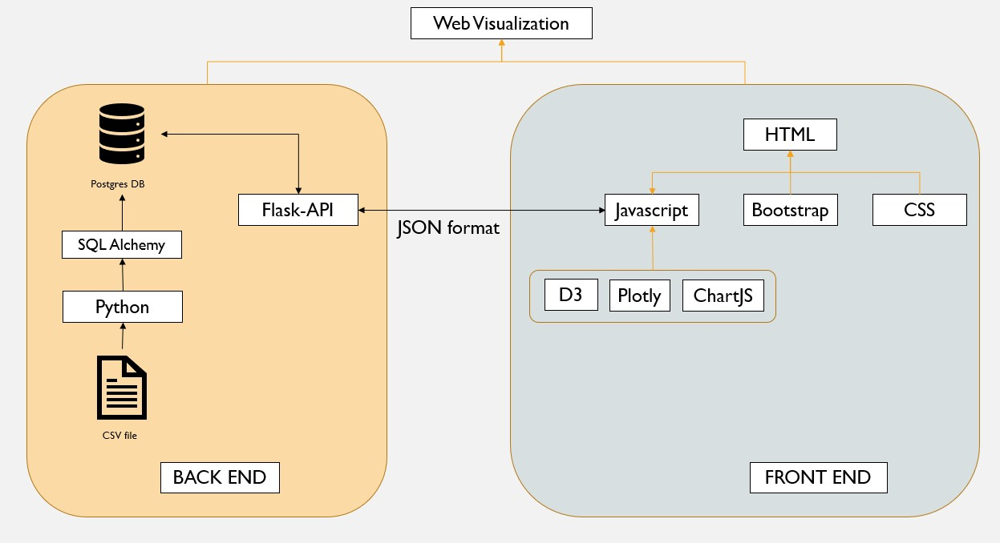
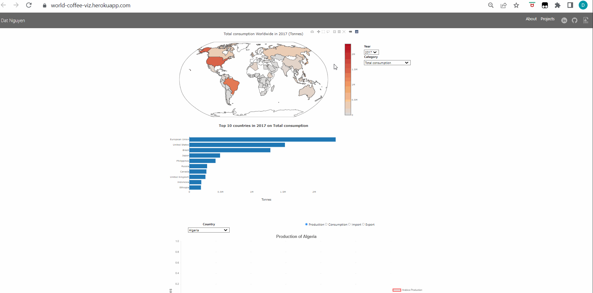

As a coffee lover, I always keen to explore the data regarding production, import/export and consumption of coffee around the world.

In this projects, I will visualize the above data on various charts including choropleth, line chart and bar chart. The charts are interactive and the user can choose various filter to display the desired data.

This is a completed standalone project in which the data was loaded to Postgres data base and hosted online (Heroku). An API backend application using Flask is developed to connect and query from the database, then return the data in Json format. A front end application using HTML and JS was use to create a website and visualization chart.

Below is the process to develope this app.

**Tools used:**
- Data ETL using Python / Jupyter Notebook
- Flask
- SQL Alchemy
- HTML
- ChartJS
- Plotly
- D3.js
- Bootstrap
- Heroku, Postgres

Here is how the app looks like.

### Some of the findings that I discovered:
- 7 of top 10 coffee production countries are not in the top 10 coffee consumption countries. Majority of the productions are exported in coffee bean state. 
- Brazil is the highest producer for Arabica coffee while Vietnam is the highest producer for Robusta coffee.
- European countries are the top countries to import coffee bean, process then export the Roast ground product or consume. 2nd highest importer is the USA (make me think of Starbuck)
- Phillipino are the highest consumer of soluble coffee, they don't like roast ground on the other hand.
- Australian loves coffee, but we are not in top 10 consumption countries yet. However, our coffee demand is still growing strong with more than 20% increment over the last 5 years.

The application was deployed successfully on Heroku at **https://world-coffee.herokuapp.com/** with database using free plan Heroku PostgreSQL. 

****Note**: On 25/8/2022, Heroku announced that the free plan hosting for hobbyist will no longer be available Starting 28/11/2022, thus the app will not be able to accessed after that time.

If you would like to see the Heroku ready to deploy app, please visit **https://github.com/datng87/coffee_worldwide_ETL**
